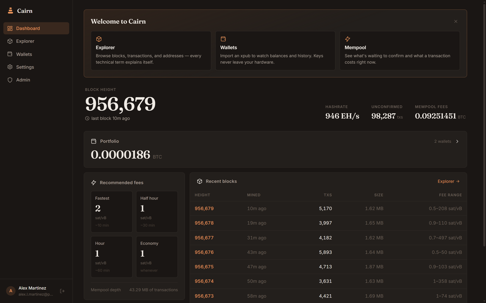
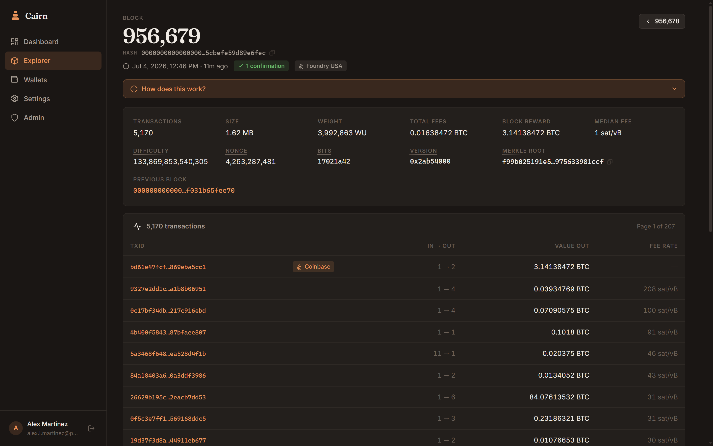
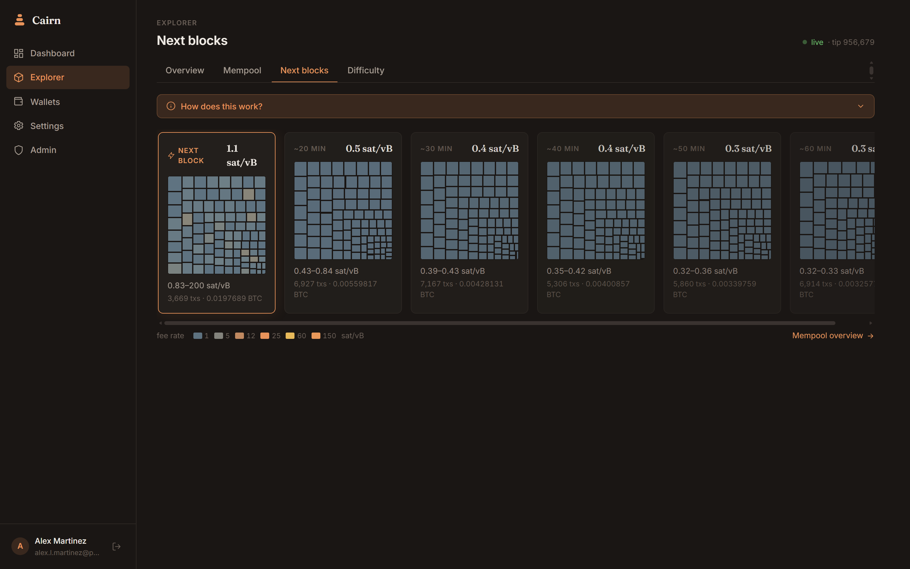
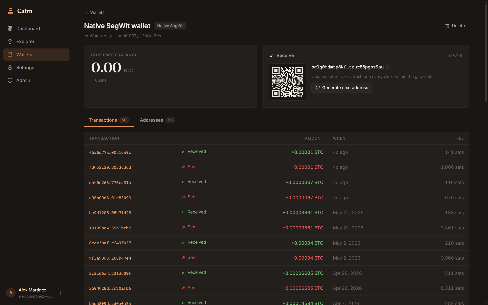
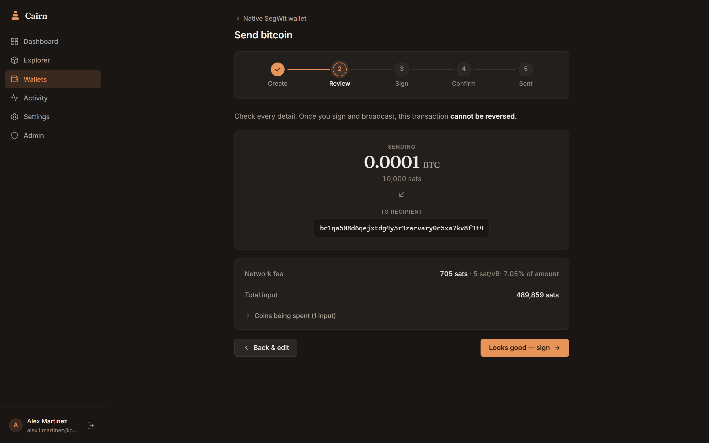
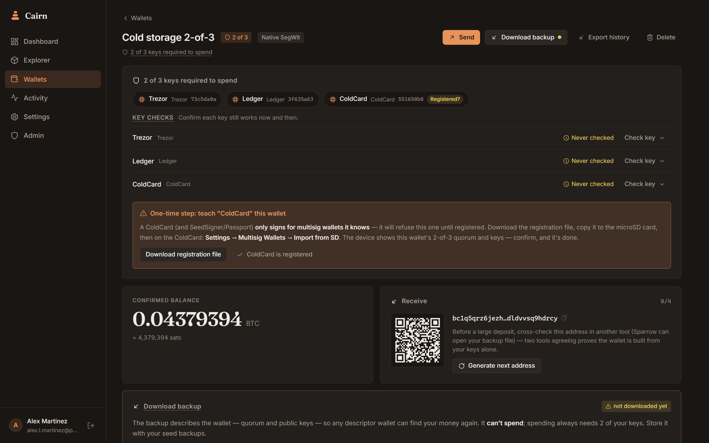

# Cairn

**Your bitcoin. Your rules.**

Cairn is a self-hosted Bitcoin command center — a block explorer, a wallet
suite that watches, sends, and signs with your hardware wallets (single-sig
or multisig), and a multi-user instance you run yourself. A cairn is a
waymarker: a stack of stones marking the path.

|                                                                       |                                                                                |
| --------------------------------------------------------------------- | ------------------------------------------------------------------------------ |
|  |  |
|  |  |
|  |  |

## Features

- **Portfolio dashboard** — every wallet on one screen: combined balance,
  history chart, allocation, and recent activity.
- **Block explorer** — blocks, transactions, addresses, mempool, and fee
  estimates, with universal search.
- **Wallet navigator** — import an xpub/ypub/zpub watch-only wallet, see
  balances, address usage, transaction history (with CSV export), and
  generate receive addresses with QR codes. Private keys never touch the
  server.
- **Send bitcoin** — a guided five-step flow (Create → Review → Sign →
  Confirm → Sent) builds a PSBT from your coins, with batch sends, coin
  control, an address book that powers recipient autocomplete, and RBF
  fee-bumping for stuck transactions.
- **Hardware-wallet signing** — sign in the browser with Trezor (Connect)
  or Ledger (WebHID), by SD card with a ColdCard, or fully air-gapped via
  animated QR codes — plus plain PSBT download/upload for anything else.
  Big transactions warn upfront how long on-device verification will take.
- **Multisig wallets** — a guided creation wizard, per-key signing stepper,
  periodic key health checks, Ledger policy registration, ColdCard
  registration files, and wallet-config import/export that round-trips
  with Caravan, Sparrow, and Unchained. A stateless signer can coordinate
  a spend from a config file without storing the wallet at all.
- **Multi-user** — email/password accounts (passkeys optional) with invite
  codes and a per-account activity feed. The first account becomes the
  administrator.
- **Admin panel** — user management, invites, registration modes
  (open / invite-only / closed), node configuration, encrypted instance
  backup/restore, and a server log viewer.
- **Works without your own node** — public Electrum + Esplora servers by
  default; point it at your own Fulcrum/electrs and mempool instance from
  the admin panel, applied live without a restart.

## Stack

- [SvelteKit](https://svelte.dev/docs/kit) + TypeScript (UI and API in one app)
- `node:sqlite` — no external database, no native addons
- Electrum protocol client (TCP/TLS) + Esplora-compatible HTTP for rich
  explorer data
- [@scure/bip32](https://github.com/paulmillr/scure-bip32) +
  [@scure/btc-signer](https://github.com/paulmillr/scure-btc-signer) for key
  derivation and PSBT construction
- Trezor Connect, Ledger WebHID, and [BBQr](https://bbqr.org/) animated QR
  for hardware-wallet signing — keys stay on the devices

## Running

Requires Node.js 22.5+ (uses the built-in `node:sqlite`).

```sh
npm install
npm run dev        # development, http://localhost:5173
```

```sh
npm run build      # production build (adapter-node)
node build         # serve it
```

The SQLite database lives in `./data/cairn.db` (override with the
`CAIRN_DB` environment variable). Back that file up and you've backed up
the instance.

## Deployment

The recommended way to run Cairn in production is Docker:

```sh
docker compose up -d --build
```

That builds the image, starts the app on <http://localhost:3000>, and
mounts `./data` into the container at `/data` for the SQLite database.
Prefer a named volume? Swap the mount in `docker-compose.yml` — the
comments show how.

> **Mount something at `/data`.** Without a volume the database lives in
> the container's writable layer and is gone the moment the container is
> replaced — along with every account, wallet, and invite.

Environment variables (defaults baked into the image):

| Variable         | Default          | Meaning                                                          |
| ---------------- | ---------------- | ---------------------------------------------------------------- |
| `CAIRN_DB`       | `/data/cairn.db` | Path to the SQLite database file.                                 |
| `PORT`           | `3000`           | Port the Node server listens on.                                  |
| `ADDRESS_HEADER` | `x-forwarded-for` | Header the server trusts for the client IP (see below).          |

`ADDRESS_HEADER=x-forwarded-for` makes the login rate limiter see real
client IPs instead of the proxy's. Only run the container behind a
reverse proxy that **sets or overwrites** `X-Forwarded-For` — if clients
can reach the port directly, they can spoof the header; unset the
variable in that case.

Reverse-proxy note: live updates use Server-Sent Events, so response
buffering must be off for `/api/events`. Cairn already sends
`X-Accel-Buffering: no` (nginx honors it out of the box); for other
proxies, disable buffering for that route.

Liveness: `GET /api/health` is unauthenticated and returns
`{"status":"ok"}` (or 503 when the database is unhappy). The image ships
a `HEALTHCHECK` that probes it.

Locked out? See [docs/RECOVERY.md](docs/RECOVERY.md).

## First run

1. Open the app — you'll land on **Create account**. The first account is
   automatically the administrator; no invite needed.
2. By default the instance uses public servers
   (`electrum.blockstream.info:50002` + `mempool.space`). Change this under
   **Admin → Settings → Node connection**.
3. Create invite codes under **Admin → Invites** to let others in.

## Configuration notes

- **Electrum server** — serves wallet balances and history. Fulcrum,
  electrs, and ElectrumX all work (TCP or TLS).
- **Esplora API** — serves block/mempool detail the Electrum protocol
  can't provide (block transaction lists, fee ranges, mempool totals). A
  self-hosted [mempool](https://mempool.space/docs) instance works, as does
  `https://blockstream.info/api` (with some fields gracefully degraded).
- **Bitcoin Core RPC** — optional; credentials are stored for upcoming
  features but nothing uses them yet. Wallet queries and transaction
  broadcasting go through the Electrum server.
