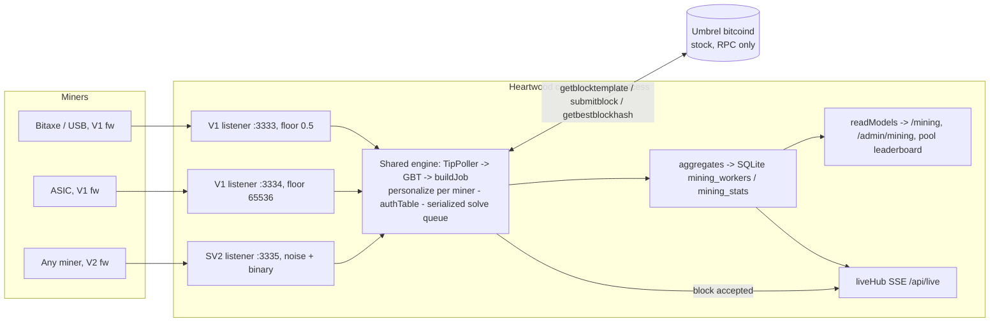

# Stratum V2 Integration Architecture

**Status:** SCOPING — no implementation. Session 2 of the SV2 wave, 2026-07-19.
**Companion doc:** `docs/SV2-PROTOCOL-RESEARCH.md` (written concurrently by a sibling
research session; this doc did its own targeted protocol reading and stands alone).
**Prereq reading:** `docs/MINING-POOL-SCOPE.md`, `docs/HASH-ATTRACTION-STRATEGY.md`,
the solo-pool legal invariant (cairn-vn43.14).

---

## 1. Current state — what Heartwood ships today (v0.2.44)

One in-process, multi-user, SOLO Stratum **V1** engine inside the SvelteKit server.
No sidecars, no extra containers. Ported from Tessera (`C:\dev\raffle\pool\src\`)
and reshaped around per-user payouts.

### 1.1 Component map

| Concern | File | Notes |
|---|---|---|
| Stratum V1 TCP server | `src/lib/server/mining/stratum.ts` | JSON-lines framing, subscribe/authorize/submit, vardiff, error codes 20-25 |
| Job builder | `src/lib/server/mining/job.ts` | `getblocktemplate` → shared job + **per-miner `personalize()`** coinbase variants |
| Engine coordinator | `src/lib/server/mining/miningPool.ts` | TipPoller → GBT → buildJob → setJob; solve → assemble → `submitblock`; serialized promise queue |
| Tip detection | `src/lib/server/mining/tipPoller.ts:50` | 1s `getbestblockhash` poll (no ZMQ) |
| Auth snapshot | `src/lib/server/mining/authTable.ts:68` | miningId → `MinerAuth{userId, walletId, payoutScript}`; 60s refresh, sync zero-I/O resolve on socket path |
| Share accounting | `src/lib/server/mining/aggregates.ts` | in-memory; 15s batched flush → `mining_workers` / `mining_stats`; liveHub nudges after flush (`aggregates.ts:240-276`) |
| Lifecycle bridge | `src/lib/server/mining/index.ts:143-193` | start gates: `mining` feature flag + operator enabled + Core RPC configured; block-accepted hooks (`index.ts:348`) advance receive cursor, insert `mining_blocks`, notify, publish SSE |
| Read models | `src/lib/server/mining/readModels.ts:140,336,508` | `getUserMiningView` / `getAdminMiningView` / `getPublicPoolView` (leaderboard, best-share, trophy wall) |
| Settings | `src/lib/server/mining/settings.ts:68-79` | kv-backed, fresh-read every call; defaults below |
| Wire math | `src/lib/server/mining/wire.ts` | all byte-order/target math; single source of truth |
| Umbrel packaging | `packaging/umbrel/heartwood/docker-compose.yml:27` | raw host port publish (`3333:3333`) because app_proxy is HTTP-only |

### 1.2 The two ports today — read this before touching port plans

Both ports speak **the same protocol (V1)** on **the same engine**; they differ
*only* in difficulty floor (`miningPool.ts:103-127`, `settings.ts:34-46`):

- **3333** — standard listener, share difficulty floor **0.5** (Bitaxe/USB class).
- **3334** — ASIC listener, floor **65536** (S19/S21 class), shipped v0.2.42
  (cairn-pz8v5). On by default. Surfaced to users in `MiningConnectionCard.svelte`
  ("point big machines here").

**Conflict flag:** the incoming SV2 sketch ("V2-native on 3334") collides with
shipped, user-visible semantics. 3334 is *not* free. See §5.

### 1.3 The money-path invariants any SV2 design must preserve

1. **Per-connection coinbase** — every `mining.notify` carries the connection's
   *own* `coinb1/coinb2` paying that miner's wallet the FULL reward
   (`stratum.ts:443-467`, `job.ts:113-146`). One value-bearing output, no splits —
   the legal hard gate cairn-vn43.14 is *asserted in code* (`job.ts:130-137`).
2. **Frozen payout per (connection, job)** — a wallet change after announce can
   never move a block being ground (`stratum.ts:152-158, 584-591`).
3. **Announce-time difficulty** — shares validate and weigh at the difficulty in
   force when the job was announced, race-free (`stratum.ts:132-137, 592-605`).
4. **Assemble-and-verify before submit** — the assembled block must hash to
   exactly the miner's found hash (`miningPool.ts:330-338`).
5. **Never crash the app** — the engine shares a process with the wallet; every
   handler is wrapped (`stratum.ts:352-365`, `index.ts` "never throws" doctrine).

### 1.4 Tessera port — what diverged (matters for "how hard is a rewrite")

Kept near-verbatim: stratum hardening (framing caps, dedupe, vardiff, stale
rate-limit), wire math, serialized event queue, JOB_WINDOW/retention. Dropped:
raffle engine/draws, flat-file persistence, `metrics.ts` (a Prometheus registry
Tessera had — Heartwood **has no Prometheus surface today**), `api.ts` REST,
`alerts.ts`, `rpc-proxy.ts`. Added: multi-user `AuthProvider`, per-connection
`personalize()`, SQLite aggregates, liveHub SSE, dual listener, notifications.
Lesson: the team has already once rewritten a stratum engine to fit the in-process
model — the marginal cost of owning protocol code here is known and was paid back.

---

## 2. SRI landscape — verified facts (2026-07)

- SRI split: `stratum-mining/stratum` now holds **low-level Rust protocol crates**
  (sv1, sv2 codec/framing/noise/channels); runnable roles moved to
  **`stratum-mining/sv2-apps`**: Pool, Translator Proxy, Job Declarator
  Client/Server. TOML-configured, Docker files provided.
- **Template Provider (TP):** Bitcoin Core rejected in-node SV2 (PR #29432
  closed in favor of a generic **Mining IPC interface**, tracking issue #31098).
  The TP is now a *sidecar* (Sjors' `sv2-tp`) speaking Core's multiprocess IPC.
  Crucially, **`-ipcbind` exists only in the new `bitcoin-node` binary** (PR
  #31802, merged 2025-08; first shipped in Core v30) — **plain `bitcoind` cannot
  serve the Mining IPC interface at all**.
- **SRI Pool role payout model:** static `coinbase_outputs` TOML config,
  currently **one** output for the whole pool. Per-channel/per-user coinbase is
  not supported; sv2-apps issue #308 ("tProxy should have a SOLO mining mode")
  shows per-miner solo semantics are still an open discussion upstream.
- **sv2-ui pattern** (also an Umbrel App Store app): a React dashboard + Express
  backend that **Dockerode-manages Translator Proxy and optional JDC containers**
  pointed at *external* SV2 pools. Monitoring is done by polling the roles'
  **HTTP monitoring APIs** (translator :9092, JDC :9091). It is a *miner-side*
  stack, not a self-hosted pool: useful as a monitoring-API precedent and as
  proof SV2 tooling passes Umbrel review, but not a template for our pool.
- Prior art for "native SV2 solo server": `schjonhaug/canary-mining` — a
  self-hosted SV2 solo server, but **built against Core IPC**, so it inherits
  the same stock-bitcoind gap.
- Miner-side momentum: ESP-Miner (Bitaxe) PR #1553 adds SV2 firmware support —
  V2-native small miners are arriving; this is the real demand driver.

---

## 3. THE critical constraint: template distribution on Umbrel

SRI's Pool role **requires** a Template Provider connection (Template
Distribution Protocol, TDP). Umbrel's bitcoin app runs stock `bitcoind`:

| Path to a TP | Verdict |
|---|---|
| Umbrel bitcoin app switches to `bitcoin-node` + `-ipcbind`, shares the IPC unix socket across app containers | Not under our control; Umbrel apps share ports, not unix sockets, today. Watch item, not a plan. |
| Heartwood ships its own `bitcoin-node` | Rejected. Second IBD/chainstate, contradicts "use the user's node" (memory: Esplora removal doctrine). |
| **GBT→TDP shim**: a process/module that polls `getblocktemplate` over the RPC connection Heartwood already has and speaks TDP to an SRI Pool role; solutions come back and go out via `submitblock` | Feasible — TDP is a small subprotocol (NewTemplate / SetNewPrevHash / RequestTransactionData / SubmitSolution), and SRI accepts an unencrypted TP connection when no authority key is configured. But it exists **only to feed SRI's pool role**, which we independently can't use unmodified (per-user coinbase, §2). |
| **Don't need a TP**: keep our own GBT pipeline as the template source and speak SV2 only on the miner-facing edge | **Chosen.** Our engine already turns GBT into jobs (`miningPool.ts:237-239, 296-314`); SV2's mining protocol doesn't care where the upstream got its template. |

**Verdict:** the TP requirement is an artifact of adopting SRI's *Pool role*,
not of adopting the SV2 *protocol*. Sidestep it: Heartwood remains its own
"template provider" via GBT. Revisit native TDP (Phase 6) if/when Umbrel ships
`bitcoin-node` with a shareable IPC endpoint — that upgrade slot is designed in,
not blocking.

**Per-user coinbase check:** SV2 is actually *friendlier* to our model than V1:
extended channels carry `coinbase_tx_prefix`/`coinbase_tx_suffix` per
`NewExtendedMiningJob`, so per-channel personalized coinbases are
protocol-native. The blocker is SRI's *Pool role implementation* (single static
payout), not the protocol. Replicating multi-user solo under SRI's pool means
forking and tracking a Rust codebase — permanent carry cost on the money path.

---

## 4. Options analysis

### Option A — Replace the V1 engine: SRI Pool role + Translator Proxy

V1 miners → Translator container → SRI Pool container → (TP problem).

- **Pros:** maximal SRI reuse; upstream maintains protocol code; noise/encryption
  for free; future JD support for free.
- **Cons (disqualifying):**
  - Needs a TP → GBT shim *and* a Rust fork for per-user coinbase — we'd be
    maintaining custom Rust on the money path while *losing* our audited TS path
    (39 parity tests, forced-solve harness).
  - Loses in-process benefits: shared SQLite (sync, same transaction domain),
    liveHub SSE nudges, zero-I/O auth resolve, "no extra containers".
  - Stats become an HTTP-polling adapter against role monitoring APIs — strictly
    worse than in-process events for the leaderboard/best-share/SSE UX.
  - Umbrel: 2-3 extra containers + inter-container noise config; app review and
    support burden grows; the V1 engine (which all current users are on) is
    deleted, so rollback is a release rollback, not a toggle.
- **Effort:** L build + permanent fork-maintenance tail. **Rejected.**

### Option B — SRI containers as feature-flagged sidecars, V1 engine intact

- First honesty check: **we don't need the Translator Proxy at all.** Its job is
  bridging V1 miners to a V2 pool — Heartwood already speaks V1 natively on
  3333/3334. A translator in front of our own V1 engine is a no-op with extra
  moving parts. The only sidecar that adds capability is the SRI **Pool role**
  for V2-native miners — which re-imports the TP shim + per-user-coinbase fork
  from Option A, now with *two* engines' worth of stats/attribution to reconcile
  (two share pipelines, two solve paths into `mining_blocks`).
- Umbrel note: sidecars would be *statically declared* containers in the app
  compose (fine, no docker-in-docker); dynamic Dockerode orchestration à la
  sv2-ui would need the docker socket — not acceptable in our app.
- **Pros:** V1 path untouched; rollback = flag off. **Cons:** all of Option A's
  gaps for the V2 path, plus dual-engine reconciliation; container sprawl for a
  niche (today) V2-native audience.
- **Effort:** M-L build + fork tail. **Rejected as the primary path** (kept as a
  fallback posture if Phase-0 findings kill Option C — see §9 risks).

### Option C — Speak SV2 natively in Heartwood's process (scoped)

Not "embed SRI" (it's Rust) but **add an SV2 listener to the existing engine**:
terminate noise + SV2 framing + the Mining Protocol (server side, standard +
extended channels) and map channels onto the machinery we already have —
`BuiltJob.personalize()` per channel, `AuthProvider` on `OpenMiningChannel.user_identity`
(same `miningId.worker` token), `ShareEvent`/`SolveEvent` into the same
aggregates/lifecycle. The engine's GBT pipeline is the template source; no TP,
no new containers, no fork of SRI.

Two implementation routes, to be decided by a spike (Phase 0):

- **C1 — pure TypeScript SV2 subset.** Noise NX (secp256k1 + ChaCha20-Poly1305 —
  `@noble/curves`/`@noble/ciphers`, house already depends on noble), binary
  framing, SetupConnection, mining subprotocol. Most control, most protocol code
  to own; crypto correctness is the risk to respect.
- **C2 — thin napi-rs native addon** wrapping SRI's own `codec_sv2`/`noise_sv2`
  crates for transport (handshake + frame encode/decode only), with all channel
  and job logic staying in TS. Reuses audited transport code; adds
  prebuild-per-arch complexity (Umbrel = amd64 + arm64; prebuildify) and an FFI
  boundary. Note v0.2.36's lesson (phantom native-dep boot crash): any native
  addon must be exercised by the prod-boot smoke gate (cairn-luqs).

- **Pros:** preserves every §1.3 invariant by construction; per-channel coinbase
  is native to SV2 extended channels; one engine, one stats pipeline, one
  Umbrel container; rollback = settings toggle; SRI drift risk limited to the
  wire layer (spec-stable) rather than pool-role behavior.
- **Cons:** we own more protocol code; noise implementation is
  security-sensitive; V2 test hardware is still scarce (mitigate: SRI's
  `mining-device` test role + Bitaxe SV2 firmware on regtest).
- **Effort:** M-L, but *bounded and phased* — and the only option whose
  steady-state maintenance is aligned with how this codebase already works.

### Recommendation

**Option C, phased, feature-flagged, with a hard Phase-0 spike gate deciding
C1 vs C2.** Justification against the constraints: Umbrel packaging unchanged
(one container, one new published port); in-process benefits kept (shared
SQLite, liveHub, per-connection coinbase — the product's differentiator);
no docker-in-docker, no docker.sock; no dependency on a Template Provider that
stock Umbrel bitcoind cannot run. SRI is still used — as the conformance
reference, as test tooling (`mining-device`, translator-as-test-client), and
possibly as the transport implementation itself (C2).

---

## 5. Port plan (resolves the 3334 conflict)

The sketch "V2-native on 3334" would repurpose a shipped, user-visible port:
3334 is the V1 **ASIC high-floor** listener (v0.2.42), advertised in the UI and
configured on real machines. Breaking it for SV2 is a support incident with zero
upside. Allocate a **new** port instead:

| Port | Protocol | Audience | Difficulty floor | Status |
|---|---|---|---|---|
| 3333 | Stratum V1 (JSON, plaintext) | small miners (Bitaxe/USB) | 0.5 | shipped — unchanged |
| 3334 | Stratum V1 (JSON, plaintext) | ASIC-class, V1 firmware | 65536 | shipped — unchanged |
| **3335** | **Stratum V2 (binary, noise-encrypted)** | any V2-firmware miner | per-channel (vardiff; high floor auto-applied for high-rate channels) | **new, flag-gated, off by default** |

- V2 needs no port-per-floor split: difficulty is per-channel (`SetTarget`), so
  one listener serves both classes; the dual-port UX remains a V1-only artifact.
- No translator port: V1 miners keep using 3333/3334 natively (§4-B).
- Umbrel compose adds `"3335:3335"`, same raw-publish mechanism and rationale as
  the existing 3333 comment block (`packaging/umbrel/heartwood/docker-compose.yml:20-27`).
  **Housekeeping flag found during this audit:** the in-repo compose is pinned at
  image 0.2.18 and maps only 3333 — it predates the 3334 ASIC port. The live
  compose lives in the store repo (`AlexM223/heartwood-app-store`,
  heartwood-bitcoin). Whichever ships first: reconcile the in-repo copy and add
  3334; then 3335 lands in both in the same change.
- Settings additions mirror the ASIC trio (`settings.ts:68-79`):
  `mining_sv2_enabled` (default off), `mining_sv2_port` (default 3335). Bind
  host follows the existing tri-state (`mining_bind`).

### Component / port diagram (target state)



---

## 6. Data flow: shares → stats → dashboard (and the adapter seam)

Under Option C the answer is pleasantly boring — **no adapter is needed**,
because SV2 shares join the existing pipeline at the event layer:

```
SV2 SubmitSharesStandard/Extended (channel N)
  → validate vs per-channel target + frozen per-channel coinbase   [new, mirrors stratum.ts:592-654]
  → ShareEvent{userId, miningId, worker, difficulty, timestampMs}  [types.ts:87-93 — unchanged]
  → aggregates.recordShare (aggregates.ts:119)                     [unchanged]
  → 15s flush → mining_workers/mining_stats + liveHub nudges       [unchanged]
  → readModels user/admin/pool views, leaderboard, best-share      [unchanged]
Solve → SolveEvent → serialized queue → assemble → submitblock     [miningPool.ts:318 — unchanged]
```

Worker identity: `OpenMiningChannel.user_identity` carries the same
`<miningId>.<worker>` token V1 uses, resolved by the same `authTable.resolve()` —
so `mining_workers` rows, the leaderboard, and best-share milestones are
protocol-agnostic. One additive stats item: tag `ConnectionInfo`/`ListenerInfo`
(`types.ts:129-144`) with `protocol: 'v1' | 'v2'` so the admin page can show the
V1→V2 adoption split.

**The seam we still design (for optionality):** define the boundary interface
now — `MiningTransport { listen, close, connections(): ConnectionInfo[] }`
emitting `ShareEvent/SolveEvent/RejectEvent` — with `StratumServer` and the new
`Sv2Server` as its two implementations. If a future decision ever *does* deploy
SRI role sidecars (e.g. a translator fleet upstream), the adapter is a third
implementation of the same interface that **polls the role's HTTP monitoring API**
(the sv2-ui precedent: translator :9092, JDC :9091 — JSON stats; SRI roles have
no Prometheus exporter we'd depend on) and synthesizes events. Stats stay
uniform whatever the edge is.

---

## 7. Migration & rollback

- **Flag-gated additive rollout:** `mining_sv2_enabled` defaults off; enabling
  binds :3335 alongside the V1 listeners. No V1 behavior changes in any phase.
- **Rollback = toggle off** (engine `reconfigureMiningEngine()` already does
  full stop/start on settings save, `index.ts:225-232`). No schema migrations on
  the rollback path: SV2 writes the same `mining_workers`/`mining_stats`/`mining_blocks`
  rows through the same aggregates.
- **No forced migration ever:** V1 ports are permanent for this product's
  audience (V1-only firmware will exist for years). SV2 is an *additional* door,
  not a replacement — messaging for the UI card as well.
- **Umbrel update path:** compose adds one port mapping; no volume/env changes;
  update-path safety per the umbrel-update-app checklist. Native addon (if C2
  wins the spike) must pass the prod-boot smoke gate (cairn-luqs) on both archs.

---

## 8. Phased implementation plan

| Phase | Contents | Size (relative to the v0.2.42 pool P1 wave ≈ M) |
|---|---|---|
| **0. Spike + decision gate** | C1 (noble-based noise NX handshake against SRI's `mining-device`/translator as test peer) vs C2 (napi-rs wrapping `noise_sv2`/`codec_sv2`); measure: handshake interop, frame round-trip, arm64 build. Written verdict; STOP if both fail interop in a week-class effort → fall back to Option B posture. | S |
| **1. Transport core** | Chosen route productionized: noise, framing, `SetupConnection`, connection lifecycle, per-connection guards mirroring `stratum.ts:352-365`. No mining logic yet. | M |
| **2. Mining protocol on the engine** | Channel management (standard + extended), `OpenMiningChannel`→authTable, per-channel `NewExtendedMiningJob` from `personalize()` (frozen payout + announce-time target invariants ported), `SetNewPrevHash`, share validation → existing event pipeline, solve → existing serialized queue. The money-path phase — parity tests against V1 behavior (39-test precedent from rg99). | L |
| **3. Surface + packaging** | :3335 listener wiring in `miningPool.ts` (third `makeServerOpts` sibling), settings + admin form, MiningConnectionCard copy ("V2 firmware? one port, encrypted"), `protocol` tag in status/readModels, Umbrel compose (in-repo reconcile + store repo). | S-M |
| **4. QA + hardening** | Regtest e2e: SRI `mining-device` + translator-as-client + Bitaxe SV2 firmware if available; forced-solve harness extended to the SV2 path; fuzz the frame decoder; loopback-default bind honored. | M |
| **5. (Optional) SRI interop docs** | Verified configs for pointing an SRI translator fleet at :3335; publishes "Heartwood is an SV2 upstream" externally. | S |
| **6. (Blocked/external) Native TDP** | When Umbrel's bitcoin app ships `bitcoin-node` with a shareable IPC endpoint: TP client replacing TipPoller+GBT (faster templates, ZMQ-class latency). Tracked, not scheduled. | M, externally blocked |

---

## 9. Risks

1. **Noise/crypto correctness (C1)** — a transport-security bug is a silent
   MITM re-exposure. Mitigation: spike gate demands interop with SRI's own
   peer; prefer C2 if the delta is close; independent review of the handshake.
2. **Protocol-surface underestimation** — SV2 mining protocol has more message
   types than V1's three; extended-channel extranonce accounting is money-path.
   Mitigation: standard-channels-first inside Phase 2; parity-test discipline.
3. **Native addon operability (C2)** — cross-arch prebuilds; the v0.2.36
   phantom-dep boot crash is the cautionary tale. Mitigation: prod-boot smoke
   gate on amd64+arm64, no dynamic `require`.
4. **V2 hardware scarcity for QA** — firmware ecosystem is early (ESP-Miner PR
   in flight). Mitigation: SRI software miners on regtest are the gate; real
   hardware is a bonus pass. Risk accepted: some field bugs will arrive with
   early adopters.
5. **Maintenance drift vs SRI/spec** — we track a living spec. Mitigation: the
   wire layer is the stable part of SV2; C2 outsources exactly that layer.
6. **Demand risk** — V2-native connect demand may stay near zero for months.
   Mitigation: phases are cut-anywhere; Phase 0-1 are cheap optionality.
7. **Umbrel IPC timeline (Phase 6)** — fully external; design keeps it additive.
8. **Port-collision/regression on 3334** — avoided by this doc's port plan;
   any future doc must treat 3333/3334 semantics as frozen.

---

## 10. Proposed beads

Do not file from this session — orchestrator files centrally. Suggested
epic: `cairn-sv2` (architecture umbrella), depends on nothing; Phase 6 item
blocked externally.

| # | Title | Description | Priority | Depends on |
|---|---|---|---|---|
| 1 | SV2 spike: C1 noble-TS vs C2 napi-rs transport | Build both minimal handshake+frame prototypes against SRI `mining-device`/translator; written verdict incl. arm64 build result; kill-criteria per §8 Phase 0. | P1 (gates everything) | — |
| 2 | `MiningTransport` seam extraction | Introduce the transport interface over `StratumServer` (no behavior change); `protocol` tag on `ConnectionInfo`/`ListenerInfo`/status/readModels. Safe to do before/parallel with the spike. | P2 | — |
| 3 | SV2 transport core (route per spike) | Noise + framing + SetupConnection + lifecycle guards; loopback-default bind; fuzz decoder. | P1 | 1 |
| 4 | SV2 mining protocol server on shared engine | Channels (standard first, then extended), authTable integration, per-channel personalized jobs with frozen-payout + announce-time-target invariants, shares/solves into existing pipeline; V1/V2 parity test suite. | P1 | 2, 3 |
| 5 | :3335 listener + settings + admin UI + connection card copy | `mining_sv2_enabled`/`mining_sv2_port` settings trio, admin form, user-facing copy; engine wiring as third listener. | P2 | 4 |
| 6 | Umbrel packaging: reconcile compose + publish 3334/3335 | Fix stale in-repo compose (still 0.2.18, missing 3334), add 3335 mapping in-repo + store repo; update-path check; prod-boot smoke incl. native addon if C2. | P2 | 5 |
| 7 | SV2 regtest e2e + forced-solve parity | SRI software-miner e2e on regtest; extend forced-solve harness to the SV2 path; block-found → notify/SSE/leaderboard assertions. | P1 (ship gate for 5/6) | 4 |
| 8 | SRI translator interop verification + docs | Verified translator TOML pointing at :3335; MANUAL.md QA runbook section. | P3 | 5 |
| 9 | Watch item: Umbrel `bitcoin-node` IPC / native TDP client | Track Umbrel bitcoin app IPC availability; when real, scope TP client replacing TipPoller+GBT. | P3 (blocked external) | 4 |
